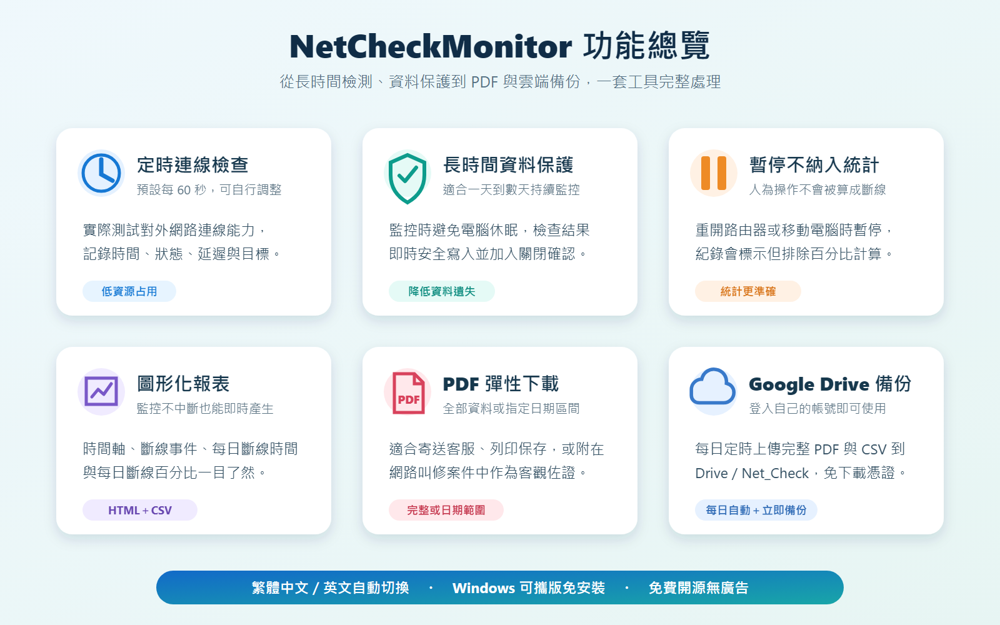
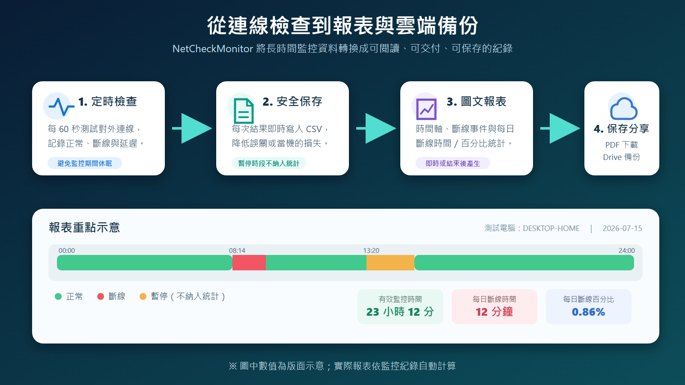

# NetCheckMonitor：免費開源的 Windows 對外網路連線能力監控程式，斷線紀錄、PDF 報表與 Google Drive 備份一次完成

家裡網路偶爾斷線，最麻煩的往往不是「當下不能上網」，而是問題發生得沒有規律：可能半夜斷幾分鐘、一天發生數次，等到聯絡電信客服時又恢復正常。只靠印象很難說明斷線發生的時間、持續多久，也缺少可以交給客服或維修人員判讀的資料。

**NetCheckMonitor** 就是為這種情境設計的 Windows 工具。它的中文名稱是「對外網路連線能力監控程式」，可以每隔固定時間檢查電腦是否真的具有對外連線能力，連續執行一整天或數天，將正常、斷線、延遲與暫停狀態持續記錄，最後產生圖形化 HTML、PDF 報表與 CSV 原始資料。

目前版本為 **0.9.2**，程式完全免費、開源、無廣告，採用 MIT License 發布。

## 為什麼不是只看 Wi-Fi 圖示？

Windows 顯示已連上 Wi-Fi 或網路線已接通，只能代表電腦與路由器之間建立了連線，不一定表示網際網路真的可以使用。光纖數據機、ISP 線路、DNS 或上游網路異常時，區域網路可能仍然顯示正常，但網頁和雲端服務已經無法存取。

NetCheckMonitor 檢查的是「**對外網路連線能力**」，重點不是網卡有沒有連線，而是電腦能不能實際連到外部網路。因此更適合用來找出家用寬頻不定時斷線、社區網路品質不穩，或需要向電信業者提出客觀資料的情況。

## NetCheckMonitor 有哪些功能？

### 每分鐘自動檢查，也能自行調整間隔

程式預設每 60 秒檢查一次對外連線。這個頻率足以掌握一般家庭網路的斷線狀況，同時不會持續占用大量 CPU、記憶體或網路流量。需要更密集或更寬鬆的觀察時，也可以在開始監控前調整秒數。

主畫面會列出每次檢查的時間、狀態、延遲與檢測目標，並同步統計有效檢查次數、正常次數與斷線次數。

### 適合執行一整天，甚至連續多天

長時間監控最怕電腦自動進入睡眠，或程式意外關閉後才發現整段資料沒有留下。NetCheckMonitor 在監控期間會避免 Windows 進入休眠，並採用即時、安全的資料寫入方式，讓每次檢查結果盡快保存到磁碟。

程式也加入關閉確認與資料保存保護。即使監控時間跨越多天，使用者仍可隨時產生即時報表，不需要先停止監控。

### 暫停與繼續，休息時間不會被誤算成斷線

如果需要重新啟動路由器、移動電腦、暫時拔除網路線，或只是暫停測試，可以按下「暫停」。暫停時段會在紀錄中清楚標示，而且不納入有效檢查與斷線百分比計算；恢復後再按下繼續即可。

這個設計可以避免人為操作污染統計結果，讓最後的斷線比例更接近真正的網路狀況。

### 監控不中斷，也能立即產生報表

測試進行中可以按下「產生即時報表」，先查看目前累積的結果，不必結束整個監控。正式結束時則可以使用「結束並產生報表」，保存最後資料並建立完整報告。即時與結束報表都會彙整所有尚未清除的歷史 CSV，不會因程式重新啟動而只剩下當次資料；只有執行「清除儲存資料」後才會重新從空白開始。

不同監控工作階段會分開累加，因此程式未執行、電腦關機、兩次執行之間的空白時間，以及完全沒有檢查紀錄的工作階段，都不會被誤算成有效監控或斷線時間。

報表會整理：

- 檢查期間與測試電腦名稱
- 正常、斷線、暫停等狀態時間軸
- 每次斷線的開始時間、持續時間與檢測結果
- 每日有效監控時間
- 每日斷線總時間
- 每日斷線百分比
- CSV 原始檢查紀錄

不同電腦產生的檔案會包含簡短的唯一識別字串與日期時間，方便將多台電腦、不同地點或不同日期的資料集中歸檔，而不容易發生檔名互相覆蓋。

## 完整資料或指定日期，都能下載成 PDF

主畫面的「下載報表 PDF 文件」可以選擇全部已保存資料，或指定開始、結束日期，只將需要的區間製作成 PDF。

如果要向 ISP 客服反映問題，可以只輸出異常發生的幾天；如果要長期觀察，也能一次整理完整期間。PDF 適合直接寄送、列印或附在叫修案件中，CSV 則保留最完整的原始資料，方便進一步分析。

產生 PDF 時會使用 Windows 內建的 Microsoft Edge 排版，因此建議在 Windows 10 或 Windows 11 使用，並保持 Edge 為可正常執行的狀態。

## 每日自動備份到自己的 Google Drive

除了儲存在本機，NetCheckMonitor 也支援 Google Drive 每日雲端備份。使用者只要按下登入，選擇自己的 Google 帳號並同意授權，不需要自行前往 Google Cloud Console 建立專案，也不必下載或指定憑證檔案。

完成連接後，可以設定每天固定的備份時間。程式會將當下完整的 PDF 報表與 CSV 原始檔上傳到 Google Drive 的 **Net_Check** 資料夾，也可以按下「立即備份今天」手動執行。

每位使用者都是登入自己的 Google 帳號；程式不會要求在 NetCheckMonitor 視窗中輸入 Google 密碼。授權資料會使用 Windows 的資料保護機制保存於目前使用者環境，降低憑證以明文外洩的風險。

> 雲端備份的價值不只是跨電腦存取。如果監控電腦故障、硬碟損壞或程式資料夾遺失，已上傳的報表與 CSV 仍保留在自己的 Google Drive。

## 繁體中文與英文介面

NetCheckMonitor 同時提供繁體中文與英文介面。第一次執行程式時會顯示語言選擇視窗：

- 選擇「繁體中文」使用繁體中文介面
- 選擇「English」使用英文介面
- 選擇結果會保存，日後不會重複詢問
- 之後仍可在設定頁手動變更，並於下次啟動程式時套用

程式不再依照 Windows 系統語言自動判斷，也不需要額外下載語言包。報表內容會配合目前選擇的介面語言產生。

## 可攜版免安裝，帶到其他 Windows 電腦就能測試

NetCheckMonitor 提供 ZIP 可攜版。下載後解壓縮，直接執行 `NetCheckMonitor.exe` 即可，不需要安裝程序，也不會強迫加入開機啟動。

這種形式特別適合：

- 帶到家人或客戶電腦測試網路
- 在不同房間比較有線與 Wi-Fi 連線品質
- 同時於多台電腦收集不同位置的數據
- 放在維修工具隨身碟中使用
- 不希望在測試電腦安裝常駐軟體

每份資料都會記錄測試電腦名稱，檔名也包含短版機器識別字串，後續集中整理時仍能知道是哪一台電腦產生的結果。

## 實際使用方式

1. 從 GitHub Releases 下載 `NetCheckMonitor-Portable.zip`。
2. 將 ZIP 完整解壓縮到可寫入的資料夾。
3. 執行 `NetCheckMonitor.exe`。
4. 確認檢查間隔，預設為 60 秒。
5. 按下「開始監控」。
6. 讓程式持續執行數小時、一天或數天；視窗可最小化到系統匣。
7. 暫時不想計算的時段使用「暫停」，完成後再繼續。
8. 測試期間可產生即時報表；測試完成後使用「結束並產生報表」。
9. 需要提交或保存時，下載全部或指定日期的 PDF。
10. 如需異地備份，再登入 Google Drive 並設定每日備份時間。

## 建議怎麼測，資料才有參考價值？

若問題是不定時發生，建議至少連續監控 24 小時；如果斷線並非每天出現，可以延長到三至七天。監控電腦最好使用平時發生問題的連線方式，例如要檢查 Wi-Fi 就不要改接網路線。

測試期間請避免任意關閉程式。需要重開路由器或移動設備時先按暫停，完成後再繼續。向電信業者叫修時，可同時提供 PDF 報表與發生異常日期的說明；如果對方需要更細的紀錄，再提供 CSV 原始檔。

## 系統需求與注意事項

- Windows 10 或 Windows 11
- .NET Framework 4.8
- Microsoft Edge，用於自動產生 PDF
- Google Drive 備份需要網路連線與 Google 帳號授權
- 程式目前為 0.9.2 版本，建議保留原始 CSV，不要只保存 PDF

Windows 或防毒軟體可能會對未經商業憑證簽署的個人開源程式顯示提醒。建議只從官方 GitHub 專案與 Releases 頁面下載，並可使用下方 SHA-256 核對檔案完整性。

## 下載 NetCheckMonitor 0.9.2

- GitHub 專案：<https://github.com/ahui3c/NetCheckMonitor>
- 最新 Release：<https://github.com/ahui3c/NetCheckMonitor/releases/tag/v0.9.2>
- Windows 攜帶版：<https://github.com/ahui3c/NetCheckMonitor/releases/download/v0.9.2/NetCheckMonitor-Portable.zip>
- 原始碼：<https://github.com/ahui3c/NetCheckMonitor/tree/v0.9.2>

檔案驗證資訊：

- `NetCheckMonitor-Portable.zip`
- SHA-256：`0C261E92B3A66A727D858ACEA697BCE0D37C1104B2921490FAA3D6DD43638398`

## 結語

網路偶發斷線之所以難處理，通常不是完全找不到問題，而是缺少連續、可閱讀、可以交付的紀錄。NetCheckMonitor 將長時間檢查、安全保存、暫停排除、每日斷線統計、圖形報表、PDF 下載與 Google Drive 備份整合在同一個可攜工具中，讓一般使用者也能用清楚的資料描述網路品質。

它不會改善網路速度，也不能代替電信業者維修線路；它做的是把「網路好像常常斷」轉換成有日期、有時間、有比例、有原始資料的證據。對家用網路除錯、長期品質觀察與叫修溝通而言，這正是最實用的一步。

---

**軟體名稱：** NetCheckMonitor（對外網路連線能力監控程式） 
**版本：** 0.9.2 
**作者：** 廖阿輝 
**網站：** <https://ahui3c.com> 
**授權：** MIT License，免費開源、無廣告
